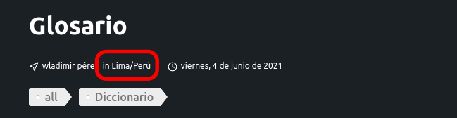

# Front Matter

## Titulo (title)

- Tipo: `string`
- Predeterminado: `indefinido`
- Requerido: `true`

El título de la página.

por ejemplo:

```markdown
---
title: Hola Mundo
---
```

## Etiquetas (tags)

- Tipo: `string|string[]`
- Predeterminado: `indefinido`
- Requerido: `false`

La clave de las páginas del clasificador y también se mostrará en la publicación:


por ejemplo:

```markdown
---
tags: 
  - JavaScript
  - DOM
---
```

## Fecha (date)

- Tipo: `YYYY-MM-DD`
- Predeterminado: `indefinido`
- Requerido: `false`

Nuestro formato recomendado es YYYY-MM-DD, pero en realidad acepta múltiples formatos. VuePress está usando `js-yaml` que sigue los tipos de yaml estándar, por lo que puede encontrar todos los formatos disponibles [aquí](https://yaml.org/type/timestamp.html).

Fecha de publicación. Esto se utilizará para el enlace permanente, la clasificación y se mostrará en el diseño:


por ejemplo:
```markdown
---
date: 2016-10-20
---
```

## autor (author)

- Tipo: `string`
- Predeterminado: `indefinido`
- Requerido: `false`

Autor de la publicación. Esto se mostrará en la publicación:


por ejemplo:

```markdown
---
author: ajwi
---
```

## location

- Tipo: `string`
- Predeterminado: `indefinido`
- Requerido: `false`

Localidad donde se desarrolla la publicación. Esto se mostrará en la publicación:




por ejemplo:

```markdown
---
location: lima
---
```

## resumen (summary)

- Type: `string`
- Predeterminado: `indefinido`
- Requerido: `false`

Resumen de la publicación. Esto se mostrará en la publicación:


por ejemplo:

```markdown
---
summary: Aquí hay una publicación rápida sobre lo que encontré..
---
```
